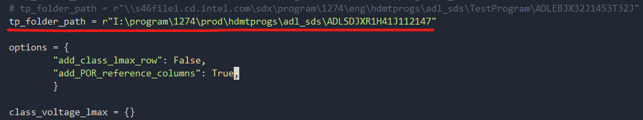
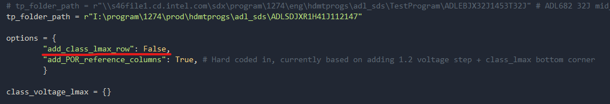
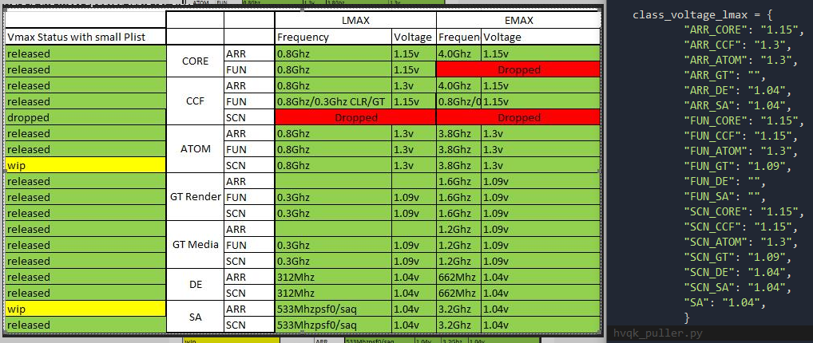
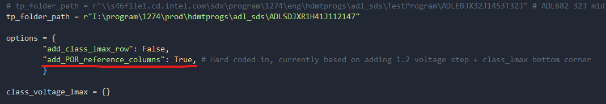
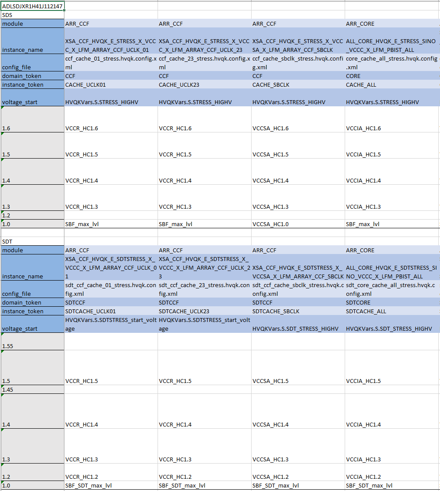
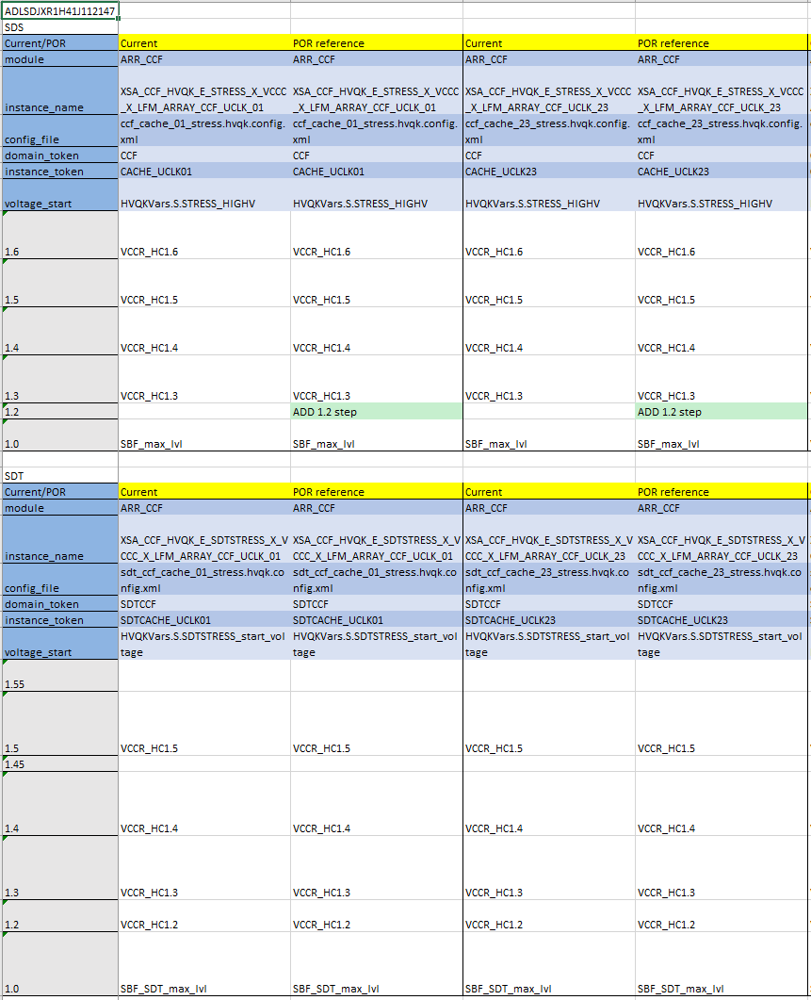

# Waterfallpuller

Waterfallpuller is a product agnostic tool integrated into [goto/toolshed](http://goto.intel.com/toolshed) that pulls and processes all hvqk.config files in a TP and exports the results as a formatted Excel.  
See [goto/waterfallpuller](http://goto.intel.com/waterfallpuller) for the wiki and sample usage.


#### How to run python script (waterfallpuller.py) instead of GUI/Toolshed.exe

Clone Repo and open up waterfallpuller.py

##### Inputs:
1. Link to the extracted TP

4. Optional: lookup for class VMAX values per IP to be used as reference at the bottom of the waterfall (warning: several hardcoded items)  


5. Optional: Option to add POR columns reference for each hvqkconfig file based on adding a 1.2 voltage step and the class_vmax lookup table (warning: several hardcoded items)  



##### Outputs:
1. Formatted excel containing all the in-use HVQK waterfalls in your TP

2. If you had the *add_POR_reference_colums* option as True, the output.xlsx will be of the form



#### Development

##### TODO
1. ~~Make script show what needs to be changed in each hvqk.config~~
2. ~~Automate the collection of indicators from the metadata file in the TP~~
3. ~~Remove dependency on LetMeAuditV4~~
4. ~~Make script output to formatted excel instead of CSV~~
5. ~~Add to goto/Toolshed~~


#### Compiling

```

pyinstaller -y ^
--add-data="lib/*.ui;lib/." ^
--add-data="lib/*.py;lib/." ^
--add-data="*.py;." ^
foldercopierlauncher.py

```
